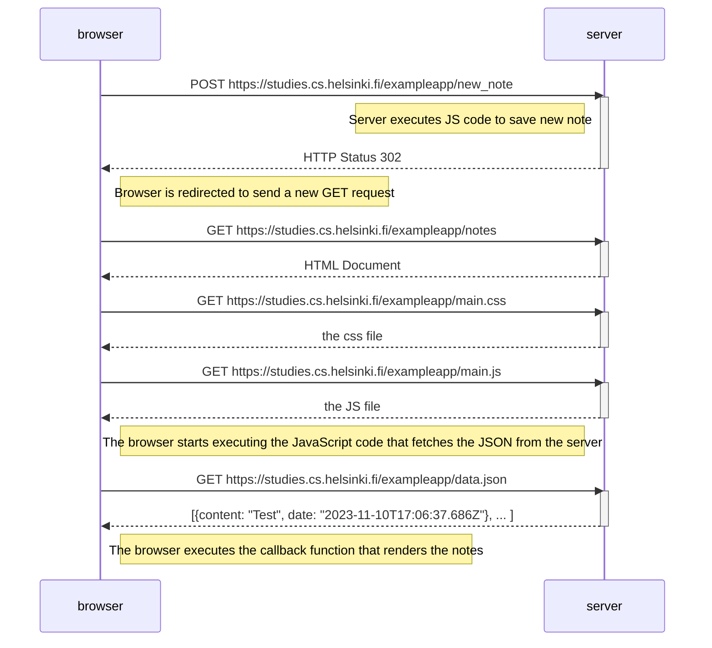

```mermaid
sequenceDiagram
    participant browser
    participant server
    
    browser->>server: POST https://studies.cs.helsinki.fi/exampleapp/new_note
    activate server
	
	Note left of server: Server executes JS code to save new note 
    
    server-->>browser: HTTP Status 302
    deactivate server
    
    Note right of browser: Browser is redirected to send a new GET request
    
    browser->>server: GET https://studies.cs.helsinki.fi/exampleapp/notes
    activate server
    server-->>browser: HTML Document
    deactivate server
    
    browser->>server: GET https://studies.cs.helsinki.fi/exampleapp/main.css
    activate server
    server-->>browser: the css file
    deactivate server

	browser->>server: GET https://studies.cs.helsinki.fi/exampleapp/main.js
	activate server
	server-->>browser: the JS file
	deactivate server
	    
    Note right of browser: The browser starts executing the JavaScript code that fetches the JSON from the server
    
    browser->>server: GET https://studies.cs.helsinki.fi/exampleapp/data.json
    activate server
    server-->>browser: [{content: "Test", date: "2023-11-10T17:06:37.686Z"}, ... ]
    deactivate server    

    Note right of browser: The browser executes the callback function that renders the notes 
```