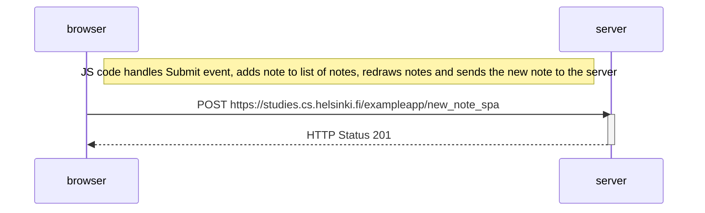

```mermaid
sequenceDiagram
    participant browser
    participant server

	Note right of browser: JS code handles Submit event, adds note to list of notes, redraws notes and sends the new note to the server
	browser->>server: POST https://studies.cs.helsinki.fi/exampleapp/new_note_spa
	activate server
	server-->>browser: HTTP Status 201
	deactivate server
```
